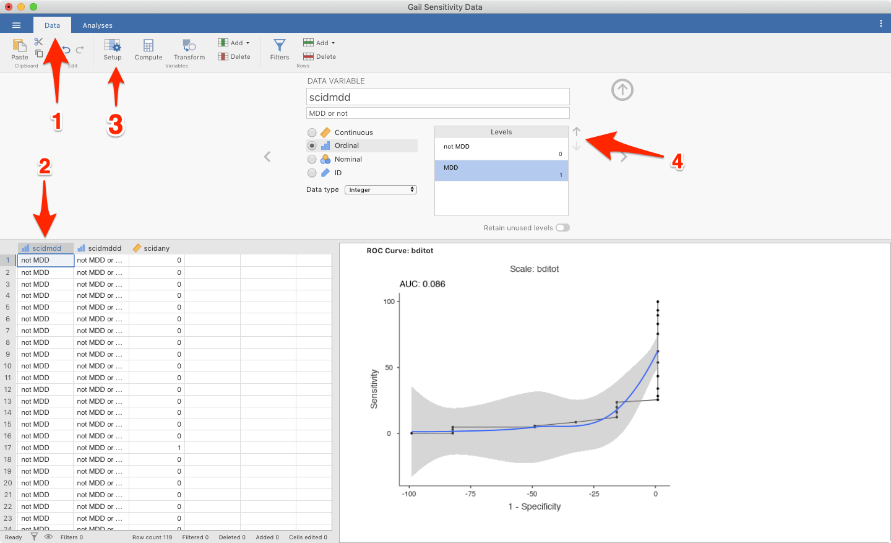

  
```{r echo=FALSE,results='hide'}
source("../R/functions.R")
```

# Common Issues

### Variable names:
`r #version("0.1.0")`

If variables have names not following R standard, some problem may still appear.

### Solution:
Use variable names without space, parentheses or brackets, etc. 

`r #version(">0.1.0")`

# Binary DIF

### **Error: Can only apply contrasts to data with 2 or more levels**

This is an error that _usually_ comes from attempting to fit a logistic model in R to data which does not have at least two different responses for each grouping variable.

For example, in data coded [0, 1] for incorrect and correct responses and two groups [m, f], it might be the case that no `f` in your data set responded inorrectly, meaning there are no `f` in the data with response `0`. This will break the `glm()` function.

Ensure that there are no rows/columns in your data with no responses, and that there are no groups who only respond in a single way.

If this doesn't seem to be the case for you, you may have encountered a bug: please feel free to contact me using a method at the bottom of this page.

# Measure Diagnostics

## Test ROC

The error messages in the Test ROC module are somewhat underdeveloped. If your answer is not here, please contact the author using the contact information at the end of this page.

### **Error: non-numeric argument to mathmatical function**

This error occurs when attempting to plot an ROC curve on an analysis that failed to run. Deselect the `ROC` option and a new, more informative error should surface.

### **AUC is wrong / ROC Curve appears wrong**

Check the factor-coding of the class variable. If the coding is backwards, the proper AUC will be 1 - AUC and the ROC will appear upside-down.

The factor levels can be changed here in the Data -> Setup tab:



`r issues()`
